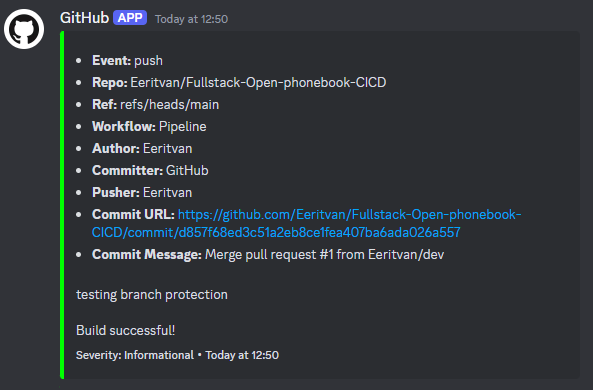

# exercises 11.20 and 11.21
Currently the pipeline is
- checking for any linting errors
- building the code
- deploying the code to fly.io
- tagging the release
- sending notification to my own discord server

the fly.io app can tested [here](https://phonebook-cicd-2024.fly.dev).

## webhook
Since the webhook isn't sending notifications to the official server but instead to my own, here is example how the notification looks:

super secret change...